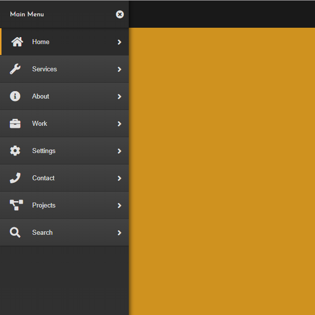

# Sidebar Example

Simple Sidebar is an off canvas sidebar navigation template created with Html, Css, JavaScript/jQuery.

## Screenshot

## Preview

View Live Preview [Here](https://msmatki.github.io/Sidebar/)

## Basic Usage

After downloading, simply edit the HTML and CSS files included with the template in your favorite text editor to make changes. To preview the changes you make to the code, you can open the index.html file in your web browser.

## Copyright and License

Copyright 2013-2018 Blackrock Digital LLC. Code released under the MIT license.

## Created With
* Html
* Css
* JavaScript
* jQuery
* FontAwesome